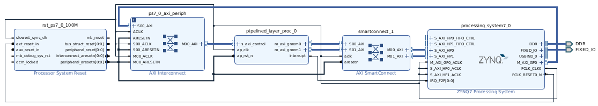
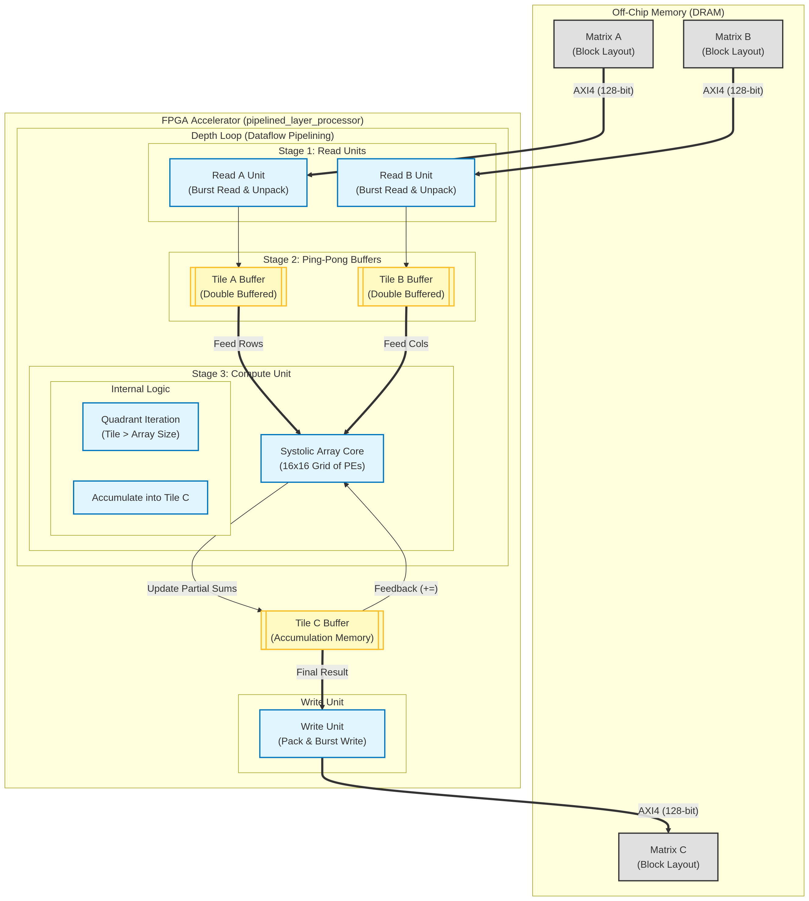
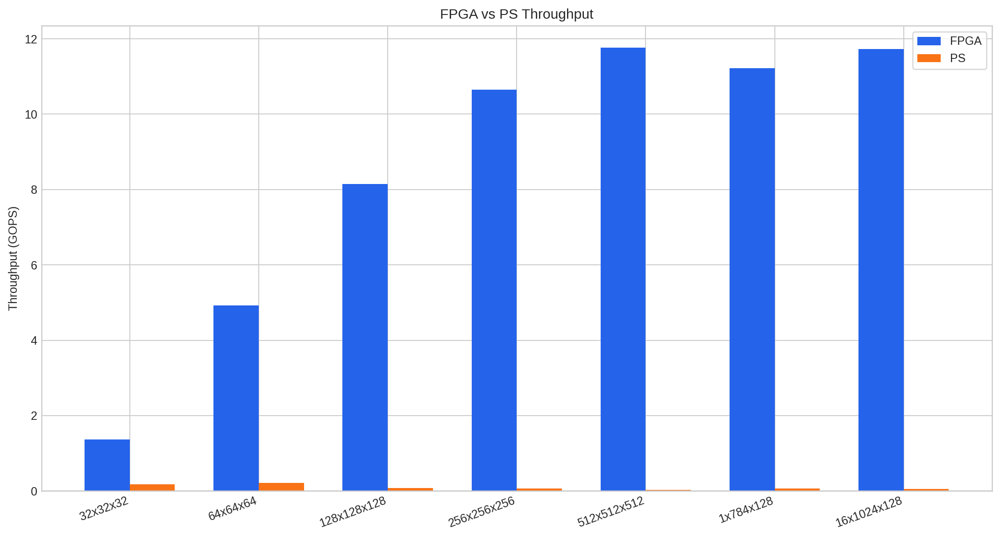
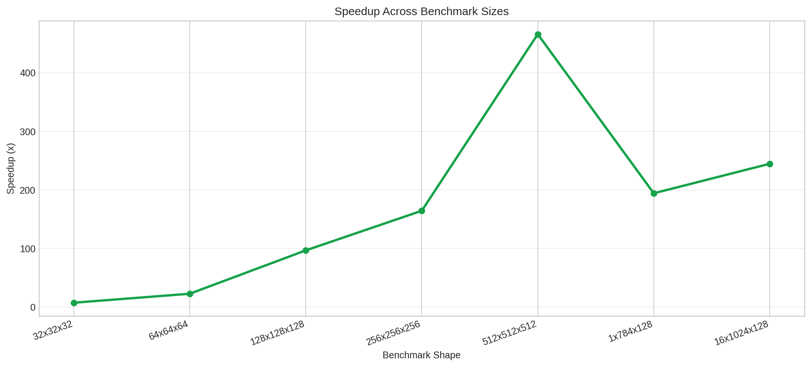

# Systolic Array on PYNQ-Z1

An FPGA accelerator project for matrix multiplication on the Digilent PYNQ-Z1 board. The design combines a tiled HLS kernel and a PYNQ notebook workflow for running the overlay from Python.

## Overview

The core accelerator is a systolic-array matrix multiply kernel implemented in HLS. It operates on packed 256-bit memory words, loads matrix tiles into on-chip buffers, computes partial products through a 16x16 systolic array, and writes the resulting output tile back to memory.

The included HLS testbench checks the hardware result against a software reference implementation and reports basic latency / throughput numbers.

## Hardware Diagram

## Architecture Overview

## Repository Layout

- `hls_project/` — HLS source, headers, and testbench files.
- `pynq_notebooks/` — Jupyter notebook and PYNQ overlay files (`.bit`, `.hwh`, `.xclbin`).

## Getting Started

If you want to work with the design quickly, start here:

1. Open `hls_project/main.cpp`, `hls_project/main.h`, and `hls_project/tb_main.cpp` in Vitis HLS or another HLS toolchain.
2. Use the provided HLS script at `hls_project/solution1/script.tcl` if you prefer a scripted flow.
3. Open `pynq_notebooks/main.ipynb` to load `design_1.bit` and exercise the accelerator on PYNQ.

## Main HLS Files

- `hls_project/main.h` — configuration constants, types, and top-level function prototype.
- `hls_project/main.cpp` — tiled read / compute / write kernel implementation.
- `hls_project/tb_main.cpp` — C++ testbench with packing, unpacking, and verification.

## Kernel Notes

- Systolic array size: `16 x 16`
- Tile size: `16 x 16`
- Input packing: `256-bit` AXI words via `vec_t`
- Output packing: `256-bit` AXI words via `vec_out_t`
- Top function: `pipelined_layer_processor`

The testbench currently uses a `32 x 64` by `64 x 32` multiply case.

## Requirements

To build or simulate the project, you will need tooling such as:

- An HLS toolchain
- Python with Jupyter and the PYNQ libraries for notebook-based interaction

## Typical Workflow

1. Open `hls_project/` in HLS and run C simulation using `tb_main.cpp`.
2. Synthesize the kernel with `main.cpp` and `main.h`.
3. Use `pynq_notebooks/main.ipynb` to load the overlay and drive the accelerator.

## Included Artifacts

- `pynq_notebooks/design_1.bit` and `pynq_notebooks/design_1.hwh` — PYNQ overlay pair.
- `pynq_notebooks/loaded.xclbin` — prebuilt overlay package.
- `hls_project/solution1/` — synthesized HLS solution outputs and reports.

## Notes

- The notebook currently assumes the overlay file is named `design_1.bit`.

## License

No license file is currently included. Add one if you want to publish or share the project publicly.

## Benchmark Results

Results from the systolic array vs. PS benchmarking suite:

Latency is shown in milliseconds, throughput in GOPS, and higher values are better.

| Problem Size | Padded Size | FPGA GOPS | FPGA ms | PS GOPS | PS ms | Speedup |
| --- | --- | ---: | ---: | ---: | ---: | ---: |
| `32x32x32` | `32x32x32` | `1.37 GOPS` | `0.05 ms` | `0.18 GOPS` | `0.36 ms` | `7.50x` |
| `64x64x64` | `64x64x64` | `4.93 GOPS` | `0.11 ms` | `0.22 GOPS` | `2.43 ms` | `22.82x` |
| `128x128x128` | `128x128x128` | `8.15 GOPS` | `0.51 ms` | `0.08 GOPS` | `49.82 ms` | `96.86x` |
| `256x256x256` | `256x256x256` | `10.65 GOPS` | `3.15 ms` | `0.06 GOPS` | `518.03 ms` | `164.47x` |
| `512x512x512` | `512x512x512` | `11.76 GOPS` | `22.82 ms` | `0.03 GOPS` | `10633.82 ms` | `466.02x` |
| `1x784x128` | `32x800x128` | `11.22 GOPS` | `0.58 ms` | `0.06 GOPS` | `113.54 ms` | `194.35x` |
| `16x1024x128` | `32x1024x128` | `11.73 GOPS` | `0.72 ms` | `0.05 GOPS` | `175.09 ms` | `244.77x` |

## Charts

Throughput comparison and speedup trend derived from the benchmark table.

Generated with `scripts/generate_benchmark_charts.py`.

**Resources Report**

- A summary of available HLS/build logs and guidance for generating resource reports is placed in `reports/RESOURCES_REPORT.md`.
- Included files: `reports/vitis_hls_log_all.xml`, `reports/pipelined_layer_processor_csim.log`.

- Added placed utilization report: `reports/design_1_wrapper_utilization_placed.rpt` (Vivado 2022.2) — contains device-level placed resource counts (LUTs, FFs, BRAMs, DSPs).

If you run the HLS synthesis (`csynth_design`) successfully on your machine, the generated resource reports (e.g., `*_csynth.rpt`) will appear under `hls_project/solution1/syn/report/` and can be copied into `reports/` for archival.